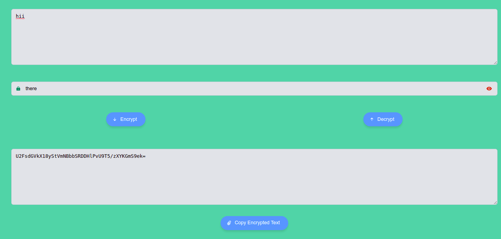

<h3 align="center">Crypto-js AES Tools</h3>

---

<div align="center">

[](https://github.com/novicexp/crypto-js-aes/blob/master/LICENSE.md) [](https://github.com/novicexp/crypto-js-aes)

</div>

---

## 📝 Table of Contents

- [About](#about)
- [Getting Started](#getting_started)
- [Built Using](#built_using)

## 🧐 About <a name = "about"></a>

Crypto-js AES encryption decryption web app

<p align="center">
 
</p>

## 🏁 Getting Started <a name = "getting_started"></a>

- clone project
  ```
  git clone https://github.com/novicexp/crypto-js-aes
  ```
  ```
  cd crypto-js-aes/
  ```
- Install packages
  ```
  yarn
  ```
- Start development server
  ```
  yarn start
  ```

## ⛏️ Built Using <a name = "built_using"></a>

- [React](https://reactjs.org/)
- [Atomize](https://atomizecode.com/)
- [Crypto-js](https://cryptojs.gitbook.io/docs/)
